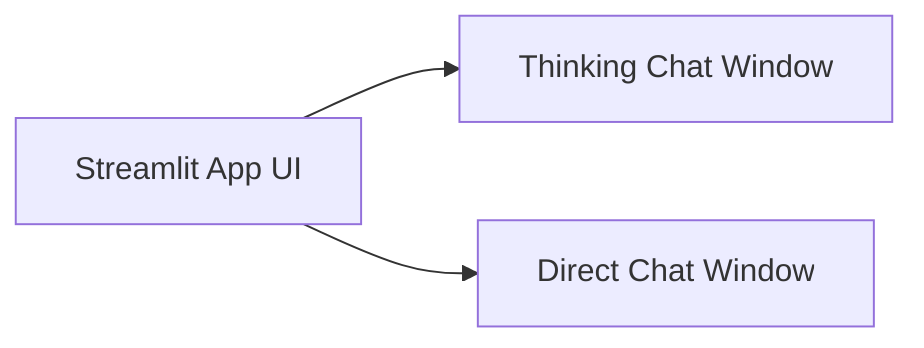

## 📄 Project Documentation: Test Custom Thinking Model

### 🧩 Project Name:

**LLM Dual Brain – Thinking Chat vs. Direct Chat**

---

## 1. 📝 Project Overview

This application is a **Streamlit-based Python app** that showcases and compares two approaches to interacting with a Large Language Model (LLM):

* **Thinking Chat**: Emulates a chain-of-thought reasoning where the LLM first plans out how it should approach the user's query.
* **Direct Chat**: The LLM responds directly to the user’s input without any intermediate thinking or planning step.

It provides a **side-by-side chat UI** to help users or researchers visualize the benefits and differences between reasoning-based and direct responses.

---

## 2. 🎯 Objectives

* To demonstrate **step-by-step reasoning** with intermediate system prompts.
* To allow real-time comparison of **planned vs direct** responses from LLMs.
* To offer a **simple research/testbed interface** for prompt engineering and reasoning evaluation.

---

## 3. 🛠️ Technology Stack

| Component        | Technology                  |
| ---------------- | --------------------------- |
| Frontend UI      | Streamlit                   |
| Backend Logic    | Python                      |
| LLM Integration  | OpenAI API (GPT-4o / GPT-4) |
| Data Handling    | Python Dicts / JSON         |
| Optional Logging | SQLite / JSON / CSV export  |
| Visualization    | Streamlit Tabs / Columns    |

---

## 4. 🖼️ User Interface Design

The UI will have:

* Two **side-by-side chat windows**.
* Each chat pane will include:

  * **User input box**
  * **Chat history display**
  * **Send button**
* Optionally: Clear button, Export button, Model selector.

### Layout



---

## 5. ⚙️ Application Logic

### Thinking Chat Flow

```plaintext
1. User inputs query → "What are the benefits of AI in education?"
2. Assistant (System Prompt Phase): 
   - Generates a "Thinking Plan" explaining what user might want and how to answer.
   - E.g., "The user is asking for practical benefits. I'll categorize the benefits..."
3. Assistant (Final Response Phase):
   - Uses the system prompt + original query to answer the user.
```

### Direct Chat Flow

```plaintext
1. User inputs query → "What are the benefits of AI in education?"
2. Assistant responds immediately to the query.
```

---

## 6. 🧠 LLM Interaction Strategy

### Thinking Chat

* Step 1: Use OpenAI API to generate a system message with `"You are a thought planner..."`.
* Step 2: Use the generated system message + original user query to generate the final answer.

### Direct Chat

* Directly send the user query as prompt to OpenAI.

---

## 7. 📦 Modules & Structure

```
llm_dual_chat/
│
├── app.py                  # Main Streamlit app
├── thinking_chat.py        # Logic for planning + response
├── direct_chat.py          # Logic for direct chat
├── utils.py                # Helper functions
├── config.py               # OpenAI keys, settings
├── prompts/
│   ├── planner_prompt.txt  # Base prompt for planning
│   └── system_prompt_gen.py
├── logs/
│   └── chat_history.json   # Optional storage
└── requirements.txt        # Dependencies
```

---

## 8. 📋 Example Output (UI Snapshot)

```
+----------------------+  +------------------------+
|  Thinking Chat       |  |  Direct Chat           |
|----------------------|  |------------------------|
| User: What is AGI?   |  | User: What is AGI?     |
|                      |  |                        |
| System: “User wants  |  | Assistant: “AGI means  |
| to understand...”    |  | machines with full     |
| Assistant: “AGI is…” |  | intelligence…”         |
+----------------------+  +------------------------+
```

---

## 9. 📦 Requirements

```txt
streamlit
openai
python-dotenv
```

---

## 10. 🔧 Sample `.env` file

```
OPENAI_API_KEY=sk-...
```
